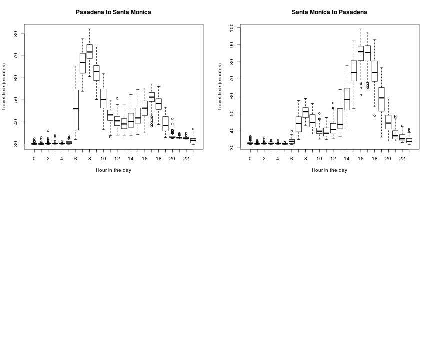
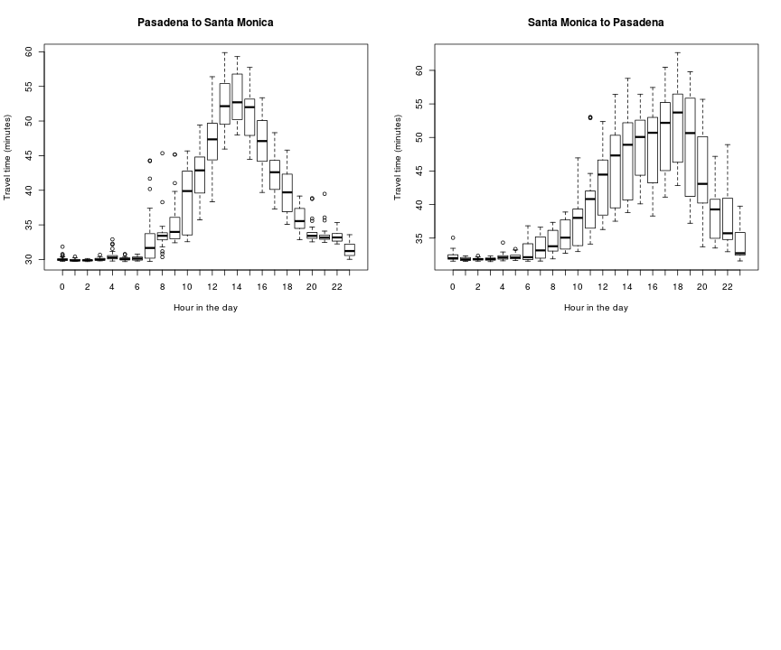

## Commute from Pasadena to Santa Monica

* about 25 miles
* goes through two of the most congested Los Angeles Freeways, the 110 and the 10
* takes 30 minutes without traffic
* can take up to 2 hours on the bad day/time
* significally different depending on the day of the week
* we want to analyze both going to work, and going back home, and find optimal working hours
* use Bing API to sample traffic estimates every 5 minutes, for 3 weeks.

--- .class #id 

## Traffic by day of week

* we can see there's lots of variance on weekdays

 

---

## Let's see how it changes on a weekday

 

---

## how about the weekend ?

 

What about dynamically estimating my commute based on 
the day of the week and the direction ?

---
## You can do that on my shiny app!

https://rcongiu.shinyapps.io/commute/

